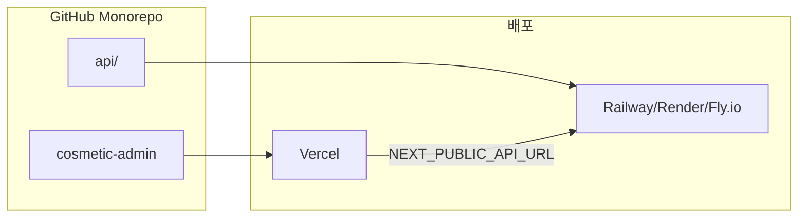

# snowwhite 배포 가이드

프로젝트는 **관리자 대시보드**와 **FastAPI 백엔드**로 구성됩니다. 각각 다른 플랫폼에 배포합니다.

## 아키텍처 개요



| 구성요소 | 디렉터리 | 배포 대상 |
|----------|----------|-----------|
| 관리자 대시보드 | `cosmetic-admin/` | Vercel |
| FastAPI 백엔드 | `api/` | Railway / Render / Fly.io |
| 챗봇 (향후) | `cosmetic-chat/` | Vercel (별도 프로젝트) |

> **현재 상태**: Git 초기화 완료, origin: `https://github.com/webkee/snowwhite.git`

---

## 1단계: GitHub에 코드 올리기

### 1.1 로컬에서 Git 초기화 (미완료 시)

```bash
cd /Users/igigi/cursor_ws/snowwhite
git init
git add .
git commit -m "Initial commit: cosmetic-admin dashboard"
git branch -M main
```

### 1.2 원격 저장소 연결 및 푸시

- 현재 origin: `https://github.com/webkee/snowwhite.git` (이미 설정됨)

```bash
# 방법 A: 직접 푸시
git push -u origin main

# 방법 B: 헬퍼 스크립트 (원격 URL 변경 시)
./scripts/push-to-github.sh https://github.com/YOUR_USERNAME/snowwhite.git
```

GitHub 인증(SSH key 또는 Personal Access Token)이 필요합니다.

---

## 2단계: 관리자 대시보드 Vercel 배포

### 2.1 Vercel 프로젝트 생성

1. [vercel.com](https://vercel.com) 접속 → GitHub 로그인
2. **Add New** → **Project** → `snowwhite` 저장소 **Import**

### 2.2 프로젝트 설정

| 설정 항목 | 값 |
|-----------|-----|
| Root Directory | `cosmetic-admin` |
| Framework Preset | Next.js |
| Build Command | `next build` |

### 2.3 환경 변수

**Settings** → **Environment Variables**:

| Name | Value |
|------|-------|
| `NEXT_PUBLIC_API_URL` | 로컬: `http://localhost:8000` / 프로덕션: FastAPI 배포 URL |

### 2.4 배포

**Deploy** 클릭 → 완료 후 `https://xxx.vercel.app` URL 생성

### 2.5 자동 배포 (CI/CD)

- `main` 브랜치에 push → 자동 Production 배포
- PR 생성 → Preview 배포 URL 발급

---

## 3단계: FastAPI 백엔드 배포 (선택)

크롤러 등 API를 사용하려면 백엔드를 별도 서비스에 배포합니다.

### 플랫폼별 옵션

| 플랫폼 | 난이도 | 비고 |
|--------|--------|------|
| Railway | 낮음 | Dockerfile 기반 |
| Render | 낮음 | Web Service, 무료 티어 |
| Fly.io | 중간 | `fly launch` (api/ 폴더에서 실행) |

### 배포 준비

1. **[api/Dockerfile](api/Dockerfile)** 사용 (Playwright Chromium 포함)
2. 필수 환경 변수: `SUPABASE_URL`, `SUPABASE_SERVICE_ROLE_KEY`
3. Supabase 마이그레이션: [api/README.md](api/README.md)의 SQL 파일을 순서대로 실행

### 배포 후 작업

1. Vercel의 `NEXT_PUBLIC_API_URL`을 백엔드 URL로 변경
2. 커스텀 도메인 사용 시: `CORS_ORIGINS`에 Vercel 도메인 추가
   - `*.vercel.app`는 [api/app/main.py](api/app/main.py)에서 이미 허용됨

---

## Monorepo: 챗봇 추가 시

향후 `cosmetic-chat` 챗봇이 추가되면 **동일 저장소**에서 **Vercel 프로젝트 2개**로 운영합니다.

| Vercel 프로젝트 | Root Directory | 결과 |
|-----------------|----------------|------|
| snowwhite-admin | `cosmetic-admin` | admin용 URL |
| snowwhite-chat | `cosmetic-chat` | chat용 URL |

---

## 체크리스트

- [x] GitHub 저장소 연결 (webkee/snowwhite)
- [ ] `git push origin main` 실행
- [ ] Vercel에서 cosmetic-admin Root Directory로 import
- [ ] `NEXT_PUBLIC_API_URL` 환경 변수 설정
- [ ] (선택) FastAPI 백엔드 배포 및 CORS 확인
- [ ] 배포 URL 접속 테스트

---

## 참고 문서

- API 설정/실행: [api/README.md](api/README.md)
